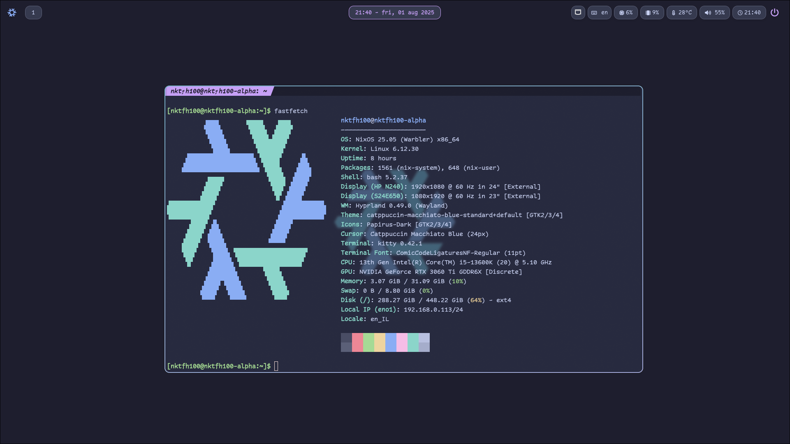

# NixOS Config

My personal NixOS configuration files I use for all my linux machines.

# Images




# What I Use

- OS: [NixOS](https://nixos.org)
- Color Scheme: [Catppuccin Macchiato](https://catppuccin.com)
- WM: [Hyprland](https://hyprland.org/)
- Terminal: [Kitty](https://sw.kovidgoyal.net/kitty)
- Shell: [Bash](https://www.gnu.org/software/bash)
- IDE: [Neovim](https://neovim.io)
- Browser: [Firefox](https://www.mozilla.org/en-US/firefox)
- Smarter cd: [zoxide](https://github.com/ajeetdsouza/zoxide)
- Status Bar: [Waybar](https://github.com/Alexays/Waybar)
- Secret Management: [sops-nix](https://github.com/Mic92/sops-nix)

# Secrets (sops-nix)

## Setup

1. **Generate an age key**:
   ```bash
   mkdir -p ~/.age
   nix-shell -p age --run "age-keygen -o ~/.age/key.txt"
   ```

2. **Get your age public key**:
   ```bash
   age-keygen -y ~/.age/key.txt
   ```

3. **Edit secrets**:
   ```bash
   nix-shell -p sops --run "sops secrets.yaml"
   ```

4. **The secrets are available at**:
   - `/run/secrets/<secret-name>`

## Adding New Secrets

1. Edit `secrets.yaml`:
   ```bash
   nix-shell -p sops --run "sops secrets.yaml"
   ```

2. Add your secret

3. Rebuild

# Install

Steps:

* Install NixOS GNOME with nktfh100 as the username.
* Create a nix shell with git package
    ```
    nix-shell -p git
    ```
* Set PC variable
    ```
    # Based on hosts folder
    PC=""
    ```
* Run install script:
    ```
    # Take ownership of /etc/nixos
    sudo chown -R $USER /etc/nixos

    # Remove the default configuration file
    rm /etc/nixos/configuration.nix

    # Clone the repo to a temp folder
    git clone --recurse-submodules -j8 https://github.com/nktfh100/nixos-config /tmp/nixos

    # Copy repo to /etc/nixos
    cp -R /tmp/nixos /etc

    # Move new hardware-configuration file to the appropriate location for this machine
    mv /etc/nixos/hardware-configuration.nix /etc/nixos/hosts/$PC/

    # Rebuild
    cd /etc/nixos && git add . && sudo nixos-rebuild switch --install-bootloader --flake .#nktfh100-$PC
    ```
